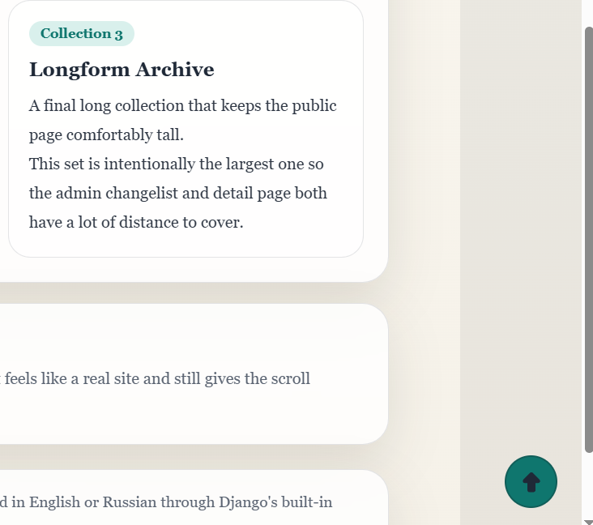

# Demo project

- [Back to documentation index](../README.md)
- [Behavior and runtime](./runtime.md)

A standalone Django project for local demo and manual testing lives under
`demo/` (a small `library` app with seeded content and a configured base
template). It is the project used to validate end-to-end integration.



## Run

```console
python demo/manage.py migrate
python demo/manage.py runserver
```

The first `migrate` seeds:

- a working `admin` / `admin` superuser;
- a published default scroll-to-top configuration for the public site;
- a published default scroll-to-top configuration for the Django admin.

## What it demonstrates

- Adding the app to an already running site and a single tag insertion into the
  base template.
- Including the package URLConf for the strict-CSP stylesheet endpoint.
- Regression of ordinary pages and the admin panel after configuration changes.

### Obstacles page

The `Obstacles` page (`/obstacles/`) demonstrates the collision engine and the
optional obstacle adapter: a bottom-right cookie banner with open/collapse/close
controls, a chat widget, a toast, and a sticky mobile navigation bar acting as
simultaneous obstacles. Use the **Toggle collision debug** button to visualize
obstacle rectangles (equivalent to `window.djstt.debug(true)`).

## Localization in the demo

- Public pages are English-only.
- The Django admin uses Django's built-in English and Russian localization.
- Demo content is original and intended for local scroll and layout testing.

## Related sections

- [Behavior and runtime](./runtime.md)
- [Quick start](./quickstart.md)
- [Presentation: templates, colors, sizing, and icons](./presentation.md)
