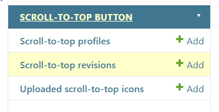
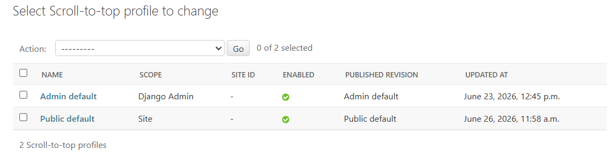
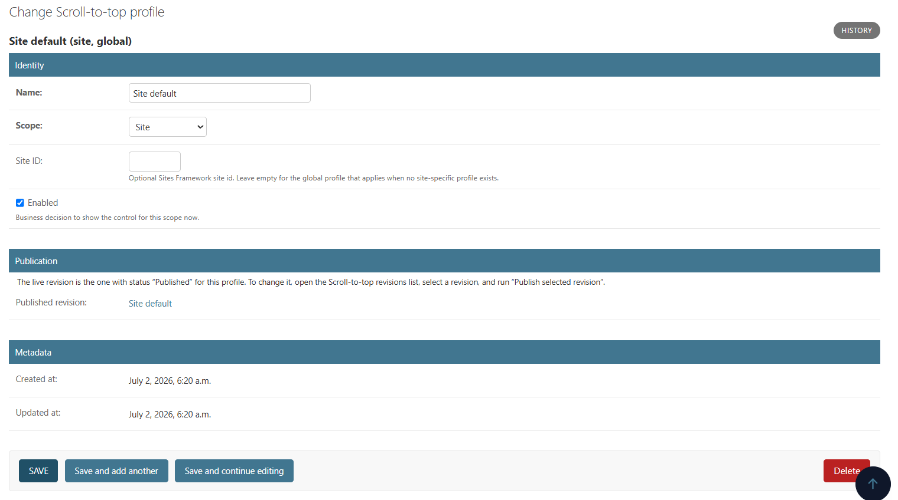
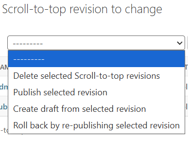
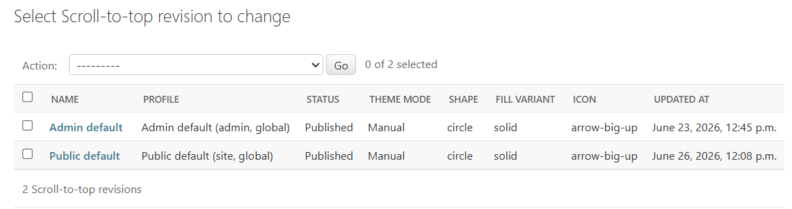
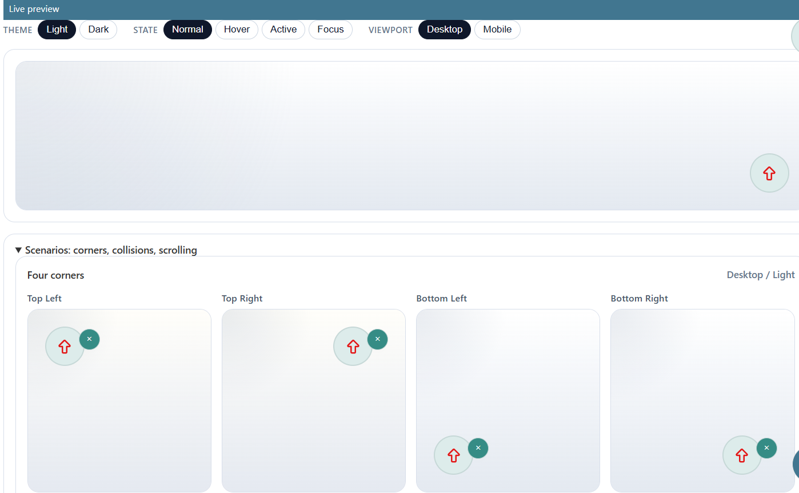

# Admin: profiles, revisions, publish and rollback

- [Back to documentation index](../README.md)
- [Configuration (settings and infrastructure)](./configuration.md)

All normal appearance and behavior is configured in Django Admin. The admin
registers three models:

- **Scroll-to-top profiles** (`ScrollTopProfile`) — one coordination record per
  scope and optional Site. It owns the scope (`site` / `admin`), an optional
  Sites Framework `site_id`, the business `is_enabled` flag, and a pointer to the
  currently published revision.
- **Scroll-to-top revisions** (`ScrollTopRevision`) — the full visual and
  behavioral snapshot plus a `draft` / `published` / `archived` status.
- **Uploaded scroll-to-top icons** (`ScrollTopUploadedIcon`) — sanitized SVG
  uploads with mandatory license/attribution metadata.

## Scopes and profiles

Site and admin scopes are independent and never resolve through the same record.
A profile is unique per `(scope, site_id)`, with one global profile per scope
(empty `site_id`). Resolution order is **site-specific → global → safe built-in
defaults**: if no enabled profile with a published revision exists, the control
still renders from built-in defaults.

`is_enabled` is the business decision to show the control for that scope now; it
is separate from per-revision behavior and from a visitor's own dismissal.

The screenshots below show the **site** profile; the **admin** scope is
configured exactly the same way, through its own profile and revision with an
identical form.

## Revision lifecycle

A revision moves through three states:

- **Draft** — editable working copy.
- **Published** — the live configuration. Editing a published revision updates
  the live site directly and invalidates that scope's cache.
- **Archived** — an immutable historical snapshot kept for rollback. Archived
  revisions cannot be edited in place (enforced in `clean()`); reuse one by
  cloning it into a new draft.

Lifecycle transitions are service operations (`services.py`) exposed as admin
actions on the revision list:

| Admin action | Service | Effect |
| --- | --- | --- |
| **Publish selected revision** | `publish_revision` | Atomically publishes the revision and archives the previously published one; updates the profile pointer and invalidates the scope cache. |
| **Create draft from selected revision** | `create_draft_from_revision` | Clones the snapshot fields into a fresh editable draft (lifecycle/bookkeeping fields are re-derived). |
| **Roll back by re-publishing selected revision** | `rollback_to_revision` | Re-publishes an existing (typically archived) revision. |

## Live preview and contrast warning

The revision change form renders a **live desktop/mobile preview** using the
production renderer, so the preview matches what the site will show. Color
contrast is **advisory only**: low-contrast combinations surface as a
non-blocking admin warning (and via `scroll_to_top_check_contrast`), but they do
not block saving — operators may pick any colors.

## Desktop and mobile values

Desktop values are primary. Each mobile-capable field (button size, icon size)
explicitly inherits the desktop value (`*_mobile_inherit = True`) or stores an
override. The admin form shows this relationship rather than hiding inheritance
behind empty values.

## Uploaded icons and attribution

Uploaded icons carry author, source, license, copyright, and attribution
metadata plus a `rights_confirmed` confirmation that the project may use and
distribute the file. Sanitizing an upload does not grant any usage right. The
uploaded-icon admin provides an **Export icon attribution report** action for
deployments that need to export attribution records. See
[security-csp.md](./security-csp.md) for the sanitizer contract.

## Related sections

- [Presentation: templates, colors, sizing, and icons](./presentation.md)
- [Behavior and runtime](./runtime.md)
- [Security, SVG sanitization, and CSP](./security-csp.md)
- [Configuration (settings and infrastructure)](./configuration.md)
