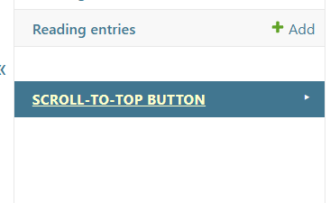

# Admin: profiles, revisions, publish and rollback

- [Back to documentation index](../README.md)
- [Configuration (settings and infrastructure)](./configuration.md)

All normal appearance and behavior is configured in Django Admin. The admin
registers three models:

- **Scroll-to-top profiles** (`ScrollTopProfile`) — one coordination record per
  scope and optional Site. It owns the scope (`site` / `admin`), an optional
  Sites Framework `site_id`, and the business `is_enabled` flag. The profile's
  live revision is derived from revision status (the revision with status
  **Published** for that profile), not a stored pointer, so you never link a
  revision to a profile by hand.
- **Scroll-to-top revisions** (`ScrollTopRevision`) — the full visual and
  behavioral snapshot plus a `draft` / `published` / `archived` status.
- **Uploaded scroll-to-top icons** (`ScrollTopUploadedIcon`) — sanitized SVG
  uploads with mandatory license/attribution metadata.

## First run: why the admin looks empty

On a fresh install the control already renders on the page from **safe built-in
defaults**, while all three admin sections are empty because nothing has been
configured yet. That is expected, not a bug — there is no seed data.

To move from the defaults to your own configuration, either:

- Click **Create starter configuration** on the Scroll-to-top profiles list.
  One click creates and publishes a default profile plus revision for the site
  and admin scopes, so the admin now mirrors the button that is already visible.
  The button is idempotent and only fills scopes that have nothing published.
- Or do it by hand: create a **profile**, create a **revision** and set its
  profile, then select the revision in the list and run **Publish selected
  revision**. Publishing is the only step that makes a revision live — you do
  not edit the profile afterwards.

Either path leaves you with one published revision per scope holding the safe
built-in defaults. From there the appearance and behavior of the control are
shaped on the **revision**, not the profile: open the published revision and
edit its fields to configure how the button looks and behaves on the site and
in the admin — shape, colors, sizing, icon, placement, visibility, and
collision handling. See [Presentation](./presentation.md) and
[Behavior and runtime](./runtime.md) for the individual fields.

If the three-item menu feels noisy, use the small **collapse toggle** on the
scroll-to-top group in the admin's left navigation sidebar (visible on model
list/detail pages); it folds away just those three items and stays collapsed
(per browser) until you expand it again. Other apps and the footer control are
not affected.

## Scopes and profiles

Site and admin scopes are independent and never resolve through the same record.
A profile is unique per `(scope, site_id)`, with one global profile per scope
(empty `site_id`). Resolution order is **site-specific → global → safe built-in
defaults**: if no enabled profile with a published revision exists, the control
still renders from built-in defaults.

`is_enabled` is the business decision to show the control for that scope now; it
is separate from per-revision behavior and from a visitor's own dismissal.

The screenshots below show the **site** profile; the **admin** scope is
configured exactly the same way, through its own profile and revision with an
identical form.

## Revision lifecycle

A revision moves through three states:

- **Draft** — editable working copy.
- **Published** — the live configuration. Editing a published revision updates
  the live site directly and invalidates that scope's cache.
- **Archived** — an immutable historical snapshot kept for rollback. Archived
  revisions cannot be edited in place (enforced in `clean()`); reuse one by
  cloning it into a new draft.

Lifecycle transitions are service operations (`services.py`) exposed as admin
actions on the revision list:

| Admin action | Service | Effect |
| --- | --- | --- |
| **Publish selected revision** | `publish_revision` | Atomically publishes the revision (status becomes the profile's live revision) and archives the previously published one; invalidates the scope cache. |
| **Create draft from selected revision** | `create_draft_from_revision` | Clones the snapshot fields into a fresh editable draft (lifecycle/bookkeeping fields are re-derived). |
| **Roll back by re-publishing selected revision** | `rollback_to_revision` | Re-publishes an existing (typically archived) revision. |

## Live preview and contrast warning

The revision change form renders a **live desktop/mobile preview** using the
production renderer, so the preview matches what the site will show. Color
contrast is **advisory only**: low-contrast combinations surface as a
non-blocking admin warning (and via `scroll_to_top_check_contrast`), but they do
not block saving — operators may pick any colors.

## Desktop and mobile values

Desktop values are primary. Each mobile-capable field (button size, icon size)
explicitly inherits the desktop value (`*_mobile_inherit = True`) or stores an
override. The admin form shows this relationship rather than hiding inheritance
behind empty values.

## Uploaded icons and attribution

Uploaded icons carry author, source, license, copyright, and attribution
metadata plus a `rights_confirmed` confirmation that the project may use and
distribute the file. Sanitizing an upload does not grant any usage right. The
uploaded-icon admin provides an **Export icon attribution report** action for
deployments that need to export attribution records. See
[security-csp.md](./security-csp.md) for the sanitizer contract.

## Related sections

- [Presentation: templates, colors, sizing, and icons](./presentation.md)
- [Behavior and runtime](./runtime.md)
- [Security, SVG sanitization, and CSP](./security-csp.md)
- [Configuration (settings and infrastructure)](./configuration.md)
