# Presentation: templates, colors, sizing, and icons

- [Back to documentation index](./README.md)
- [Admin: profiles, revisions, publish and rollback](./operations-admin.md)

Appearance is built from controlled package CSS classes selected by revision
fields — never arbitrary templates or CSS stored in the database. Unknown shapes,
fills, or shadows fall back to safe defaults, and forced-colors mode neutralizes
every variant. Every field below lives on `ScrollTopRevision`. These screenshots
show the site scope; the admin scope offers the identical form.

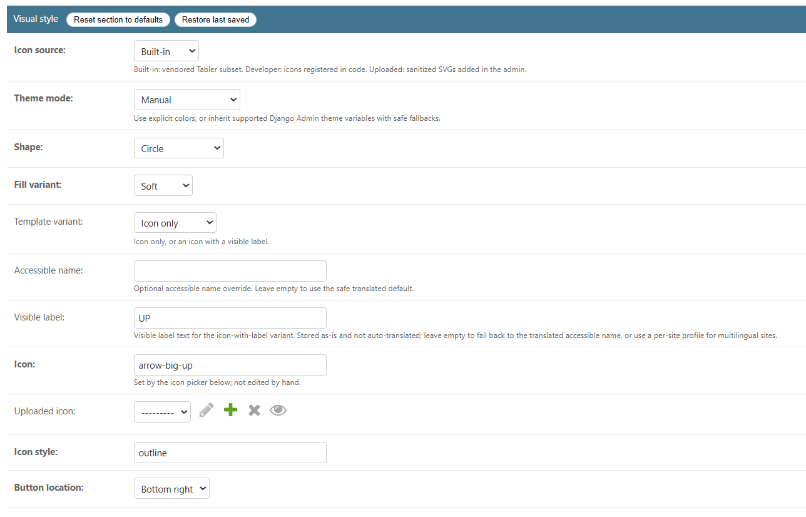

## Template variant and shape

- **Template variant** (`template_variant`): `icon-only` or `icon-label` (an icon
  with a visible label).
- **Shape** (`shape`): `circle`, `square`, `rounded-square`, `pill`.
- **Fill variant** (`fill_variant`): `solid`, `outline`, `soft`, `ghost`, `glass`
  (translucent with a backdrop-blur fallback), `gradient` (two colors and an angle).

The shape previews below use the **soft** fill so the outline is easy to see; the
default shape is the **circle** shown in the overview screenshots.

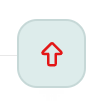
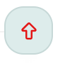
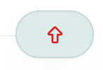

Fill variants (`solid`, `outline`, `soft`, `ghost`, `glass`, `gradient`):

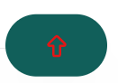
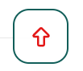
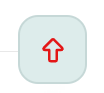
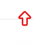
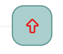
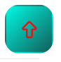

The `icon-label` template variant renders the icon with a visible label:

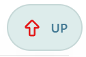

## Sizing (desktop primary, mobile inherits or overrides)

- Button size: `size_desktop`, `size_mobile_inherit`, `size_mobile`.
- Icon size: `icon_size_desktop`, `icon_size_mobile_inherit`, `icon_size_mobile`.

A minimum target floor keeps the control accessible regardless of configured
size; see [accessibility.md](./accessibility.md).

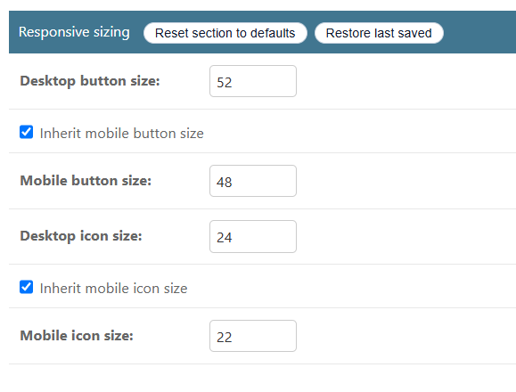

## Styling knobs

- `shadow_preset` (`none` / `small` / `medium` / `large`), `opacity` (0–1),
  `border_width`, `focus_ring_width`, `focus_ring_offset`.
- Gradient fill: `gradient_start_color`, `gradient_end_color`, `gradient_angle`.
- Glass fill: `backdrop_blur` (applied where the browser supports it).

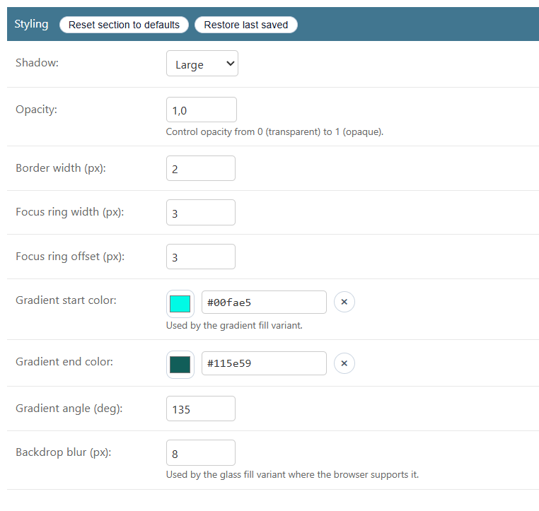

## Colors and theme mode

`theme_mode` is either `manual` (explicit colors) or `inherit_admin_theme`
(inherit supported Django Admin theme variables with safe fallbacks, plus
namespaced `--dstt-admin-*` adapter hooks for third-party admin themes).

Each state has light and dark color fields, validated as hex colors in `clean()`:

- Light: `foreground_color`, `background_color`, `border_color`, and their
  `hover_*` and `active_*` variants, plus `focus_ring_color`.
- Dark: the matching `dark_*` fields.

Icon color resolves in priority order: the **icon color override**
(`icon_color` / `dark_icon_color`) when set, otherwise the **foreground color**
(which is also the label color). Overrides only affect icons that paint with
`currentColor`.

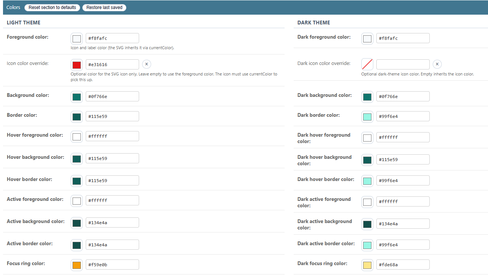

## Placement and side click zone

- **Corner** (`corner`): `top-left`, `top-right`, `bottom-left`, `bottom-right`.
- **Side click zone** (`hot_zone_placement`): an optional full-height clickable
  strip along a screen edge that also scrolls to top (`none` / `button` / `left`
  / `right`), with `hot_zone_width` and `hot_zone_appearance`
  (`hover` / `hidden` / `visible`).
- `admin_demo_corner` only affects where the floating demo button sits while
  editing in the admin; it does not change the live site.

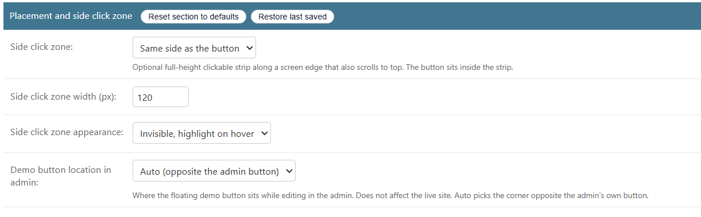
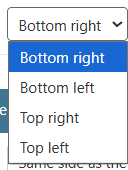

## Icons

The unified catalog has three sources (`icon_source`):

- `builtin` — the vendored Tabler starter subset (already uses `currentColor`, so
  it recolors automatically);
- `developer` — icons registered by trusted project code via
  `register_developer_icon(...)`;
- `uploaded` — sanitized SVGs added through the admin (`ScrollTopUploadedIcon`).

`icon_name` is set by the admin icon picker (not edited by hand), and
`icon_style` selects outline or filled where both exist. For an icon to pick up
the configured color it must paint with `currentColor`
(`fill="currentColor"` / `stroke="currentColor"`). Multicolor/original uploaded
icons keep their own colors and ignore the color fields. The Tabler subset is
MIT-licensed; see [THIRD_PARTY_LICENSES.md](../../THIRD_PARTY_LICENSES.md).

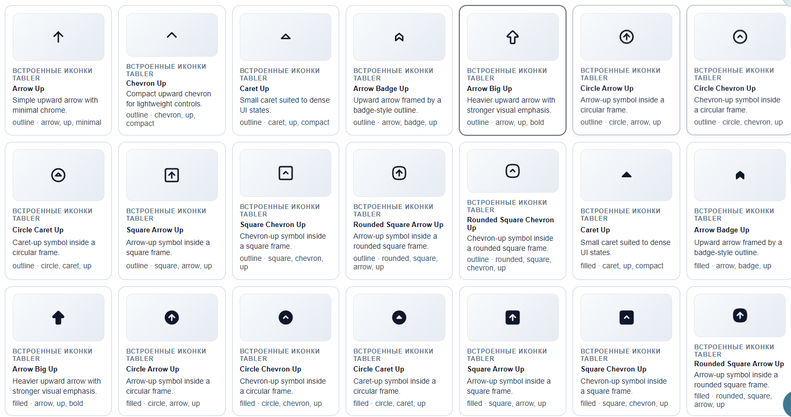

## Labels and integration class

- `aria_label` — optional accessible-name override; empty uses the translated
  default.
- `label_text` — visible label for the icon-with-label variant (stored as-is, not
  auto-translated; use a per-Site profile for multilingual sites).
- `custom_css_class` — optional space-separated tokens (letters, digits, hyphen,
  underscore) added to the control wrapper for project integration.

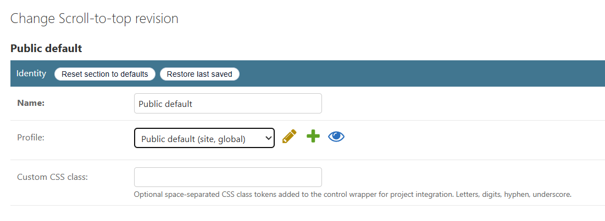

## Related sections

- [Behavior and runtime](./runtime.md)
- [Accessibility](./accessibility.md)
- [Security, SVG sanitization, and CSP](./security-csp.md)
