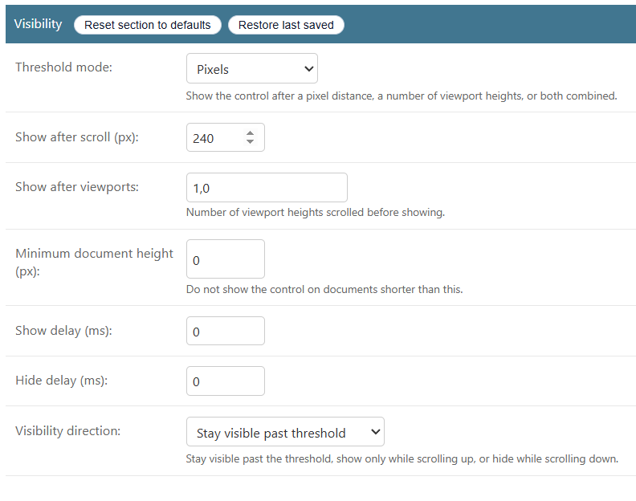
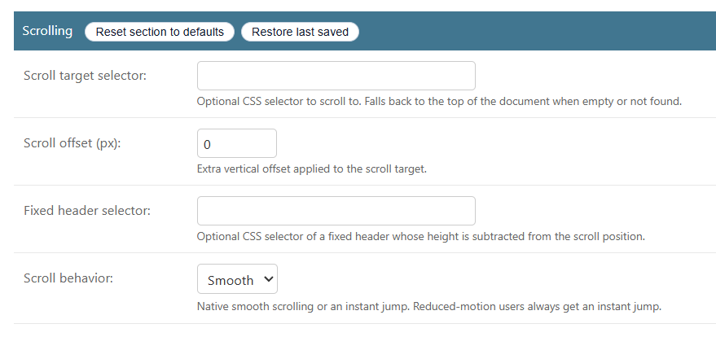
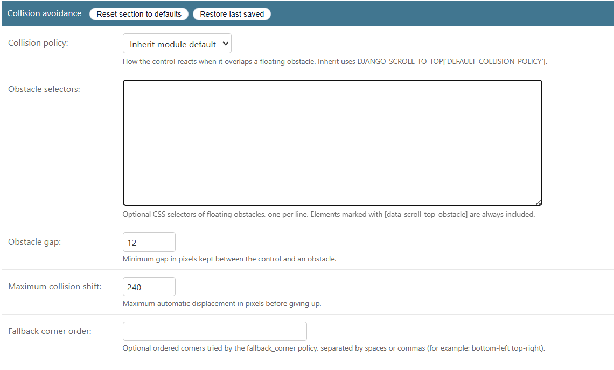
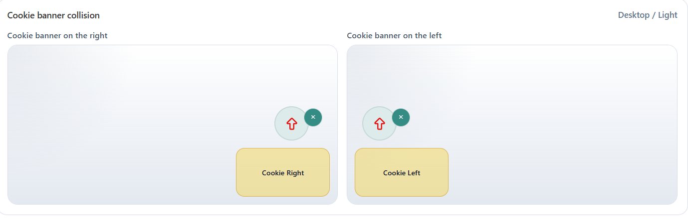
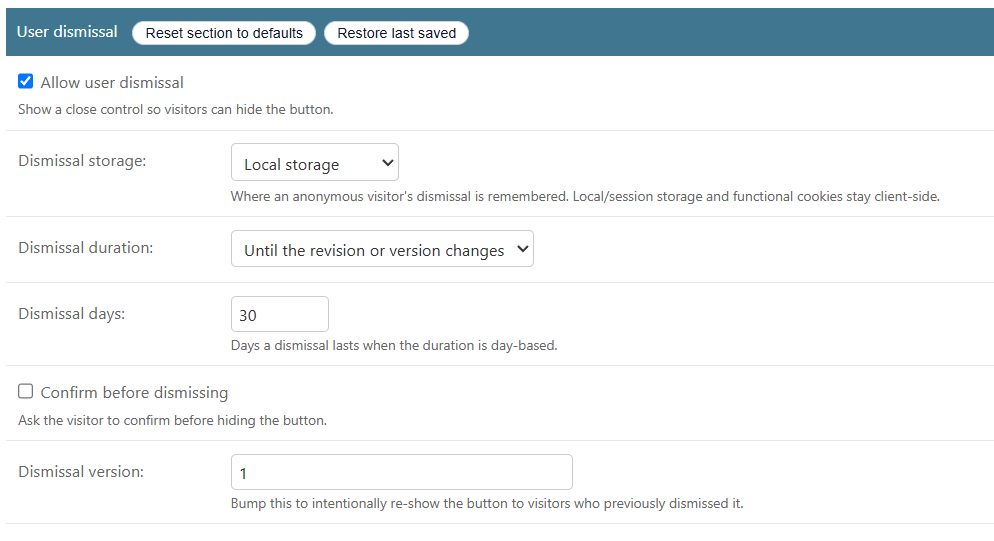

# Behavior and runtime

- [Back to documentation index](../README.md)
- [Presentation: templates, colors, sizing, and icons](./presentation.md)

The browser runtime ships as vanilla ES5 (`scroll-to-top.js`, reproducibly
minified to `scroll-to-top.min.js`). It keeps **visibility, scrolling, collision,
and dismissal as separate state machines**. The no-JavaScript baseline is a plain
top-of-document link in the configured corner; collision avoidance, theming, and
dismissal are progressive enhancements. The typed contract is published in
`scroll-to-top.d.ts`.

## Visibility and scrolling

Each revision configures when the control appears and where it scrolls:

- **Threshold mode** (`threshold_mode`): `pixels`, `viewport`, or `combined`, with
  `show_after_px`, `show_after_viewports`, and a `min_document_height_px` floor so
  short pages never show the control.
- **Direction** (`visibility_direction`): `always`, `scroll_up_only`, or
  `hide_on_scroll_down`; plus `show_delay_ms` / `hide_delay_ms`.
- **Scroll target**: optional `scroll_target_selector` with `scroll_offset_px`,
  and an optional `fixed_header_selector` whose height is subtracted — falling
  back to the top of the document when empty or not found.
- **Scroll behavior** (`scroll_behavior`): `smooth` or `instant`, using native
  `window.scrollTo`. Reduced-motion users always get an instant jump.
- Page-level opt-out: add `data-scroll-top="disabled"` to `<body>`.




## Collision avoidance

The runtime measures visible obstacle rectangles and applies the revision's
`collision_policy` (`inherit` / `ignore` / `shift` / `fallback_corner` / `hide`;
`inherit` uses `DEFAULT_COLLISION_POLICY`). Obstacles come from elements marked
`data-scroll-top-obstacle`, from the revision's `obstacle_selectors`, and from the
`OBSTACLE_SELECTORS` settings hook. Tuning knobs: `obstacle_gap`,
`collision_max_shift`, and `fallback_corner_order`. Cross-origin iframe contents
are never inspected.




### Example: the django-cookies-152fz cookie banner

The `django-cookies-152fz` banner and its launcher pin to the bottom-right
corner — the same corner as a default control — so the two overlap until the
control is told about the banner:


Fix it entirely in the admin, with no code. Open the published revision, and in
the **Collision avoidance** section set **Obstacle selectors** to the banner's
launcher and panel (one selector per line), keep a moving **Collision policy**
(`shift`), and save:

```text
[data-cookie-banner-launcher]
[data-cookie-banner-panel]
```

Editing the published revision updates the live site immediately. The control now
rides up above the cookie launcher:


The full write-up, including the alternatives, is in
[Avoiding third-party floating widgets (collision)](../recipes/floating-widget-collision.md).

## User dismissal

Persistent dismissal is separate from temporary visibility and from the admin
`is_enabled` flag:

- `allow_user_dismissal` renders a visible close control.
- `dismissal_storage`: `local`, `session`, functional `cookie`, or `none`
  (in-memory). The default `local` stores nothing until the visitor dismisses.
- `dismissal_duration`: `persistent` (until the configuration token or
  `dismissal_version` changes) or `days` via `dismissal_days`.
- `dismissal_requires_confirmation` asks before hiding; `dismissal_version` is an
  explicit knob to re-show the control.

Storage keys are namespaced by scope, Site, configuration token, and dismissal
version, and storage access tolerates denied/unavailable storage without breaking
the scroll action.




## JavaScript API: `window.djstt`

One documented global entrypoint (contract `version` `"1"`):

| Method | Purpose |
| --- | --- |
| `init(root?)` | Initialize every control within `root` (default: whole document). Idempotent. |
| `refresh(root?)` | Re-measure and re-evaluate visibility; initializes any new control. |
| `destroy(root?)` | Tear down controls, removing listeners and observers. |
| `dismiss(root?)` | Programmatically dismiss matching controls (honours storage). |
| `restore(root?)` | Restore previously dismissed controls. |
| `debug(enabled, root?)` | Toggle collision debug overlays. |

For SPA / fragment navigation, call `window.djstt.init(fragmentRoot)` after
HTMX-like replacement, or `window.djstt.refresh()` after Turbo-like full-page
navigation.

## DOM events

Namespaced `CustomEvent`s bubble from the `.dstt-control-wrap` element, so they
can be observed on the element, `document`, or `window`:

| Event | `detail` |
| --- | --- |
| `djstt:show` / `djstt:hide` | `{ visible: boolean }` |
| `djstt:scroll-start` / `djstt:scroll-end` | `{ top: number }` |
| `djstt:dismiss` | `{ dismissed: boolean, storage: string }` |
| `djstt:restore` | `{ dismissed: boolean }` |

## Optional obstacle adapter

For floating widgets that are hard to target with a single static selector, an
optional adapter ships at `obstacle-adapter.js` (loaded only where you include
it; never a dependency). `window.djsttObstacleAdapter.register({...})` tags
matching markup with `data-scroll-top-obstacle` (including elements inserted
later) and bridges open/close/collapse events to `window.djstt.refresh()`.
Ready-made presets include `djangoCookies152fz` and `stickyBottomNavigation`. See
the [project overview](../../README.md#optional-obstacle-adapter) for a full
example.

## Public surface

The stable public surface is `window.djstt`, the `djstt:*` events, the
`data-dstt-*` attributes on the control wrapper, the `data-scroll-top-obstacle`
marker, and the `django_scroll_to_top/scroll_to_top.html` template. Internal
service and model APIs are not part of the public contract.

## Related sections

- [Accessibility](./accessibility.md)
- [Configuration (settings and infrastructure)](./configuration.md)
- [Demo project](./demo.md)
