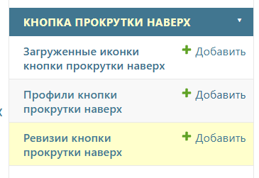
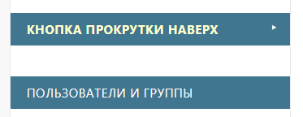
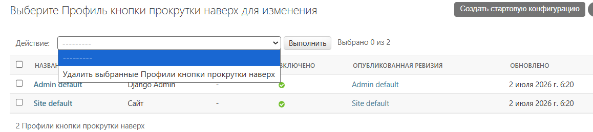
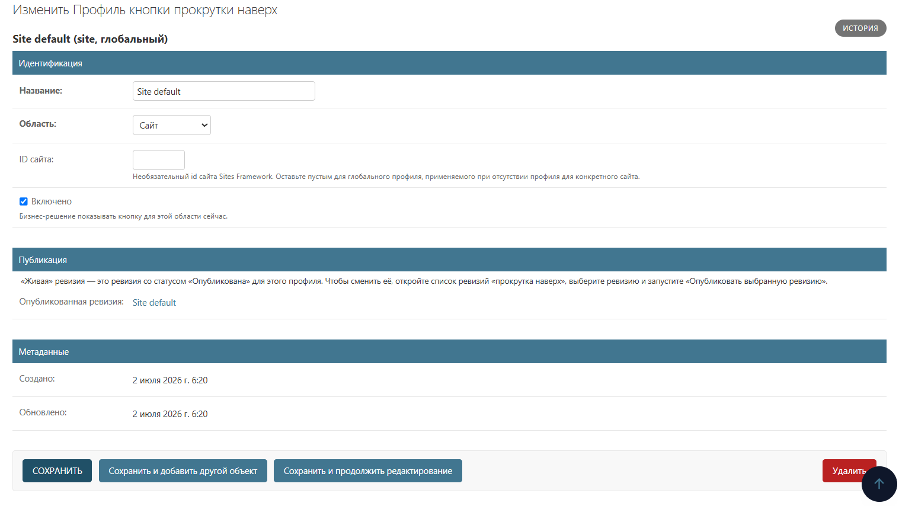
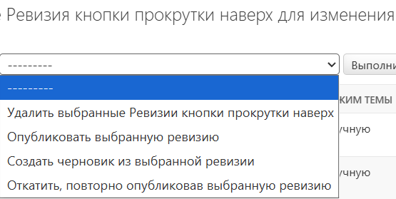
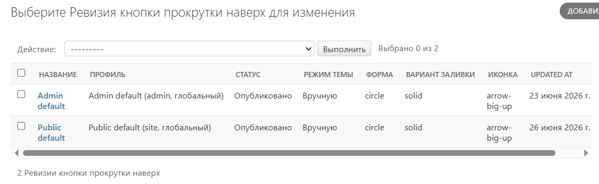
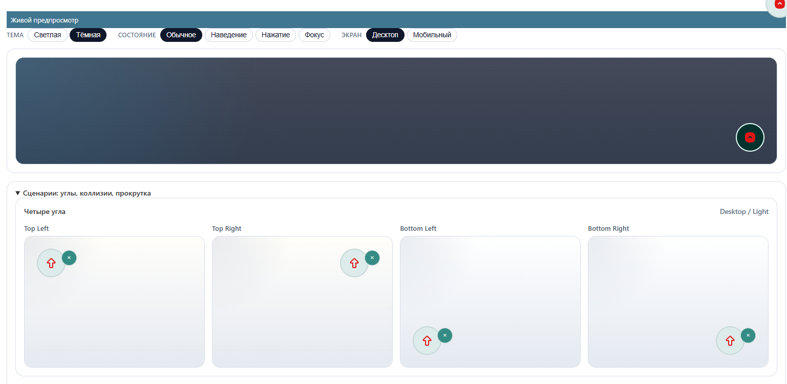

# Админка: профили, ревизии, публикация и откат

- [Назад к индексу документации](../README.ru.md)
- [Конфигурация (настройки и инфраструктура)](./configuration.md)

Весь обычный внешний вид и поведение настраиваются в админке Django. Админка
регистрирует три модели:

- **Профили «прокрутка наверх»** (`ScrollTopProfile`) — одна координирующая
  запись на область и необязательный Site. Хранит область (`site` / `admin`),
  необязательный `site_id` Sites Framework и бизнес-флаг `is_enabled`. «Живая»
  ревизия профиля определяется по статусу ревизии (та, у которой статус
  **Опубликована** для этого профиля), а не по хранимому указателю — привязывать
  ревизию к профилю вручную не нужно.
- **Ревизии «прокрутка наверх»** (`ScrollTopRevision`) — полный снимок внешнего
  вида и поведения плюс статус `draft` / `published` / `archived`.
- **Загруженные иконки** (`ScrollTopUploadedIcon`) — санитизированные SVG с
  обязательными метаданными лицензии/атрибуции.

## Первый запуск: почему админка пустая

На свежей установке элемент уже отрисовывается на странице из **безопасных
встроенных значений**, а все три секции админки пусты, потому что ещё ничего не
настроено. Это ожидаемо, а не ошибка — сид-данных нет.

Чтобы перейти от дефолтов к своей конфигурации, есть два пути:

- Нажать **«Создать стартовую конфигурацию»** в списке профилей. Один клик
  создаёт и публикует профиль с ревизией по умолчанию для областей «site» и
  «admin», и админка становится зеркалом уже видимой на странице кнопки. Действие
  идемпотентно и заполняет только области, где ничего не опубликовано.
- Или сделать вручную: создать **профиль**, создать **ревизию** и указать ей
  профиль, затем выбрать ревизию в списке и запустить **«Опубликовать выбранную
  ревизию»**. Публикация — единственный шаг, который делает ревизию активной;
  профиль после этого редактировать не нужно.

В любом случае у вас окажется по одной опубликованной ревизии на область с
безопасными встроенными значениями. Дальше внешний вид и поведение элемента
настраиваются именно в **ревизии**, а не в профиле: откройте опубликованную
ревизию и правьте её поля — форму, цвета, размеры, иконку, размещение, видимость
и обработку столкновений — чтобы задать, как кнопка выглядит и ведёт себя на
сайте и в админке. Отдельные поля описаны в
[Представлении](./presentation.md) и [Поведении и браузерном слое](./runtime.md).

Если меню из трёх пунктов мешает, воспользуйтесь маленьким **переключателем
сворачивания** на группе scroll-to-top в левой боковой панели админки (она видна
на страницах списков и форм): он сворачивает только эти три пункта и держит их
свёрнутыми (в пределах браузера), пока вы снова не раскроете. Другие приложения и
футер-кнопка не затрагиваются.

## Области и профили

Области «site» и «admin» независимы и никогда не разрешаются через одну запись.
Профиль уникален по `(scope, site_id)`, при этом на область приходится один
глобальный профиль (пустой `site_id`). Порядок разрешения — **профиль сайта →
глобальный → безопасные встроенные значения**: если нет включённого профиля с
опубликованной ревизией, элемент всё равно отрисовывается из встроенных
значений.

`is_enabled` — это бизнес-решение показывать элемент для области сейчас; оно
отделено от поведения ревизии и от скрытия элемента самим посетителем.

На скриншотах ниже показан профиль области **«site»**; область **«admin»**
настраивается точно так же — через свой профиль и ревизию по идентичной форме.

## Жизненный цикл ревизии

Ревизия проходит три состояния:

- **Черновик (draft)** — редактируемая рабочая копия.
- **Опубликована (published)** — живая конфигурация. Редактирование
  опубликованной ревизии напрямую обновляет сайт и инвалидирует кэш этой области.
- **Архив (archived)** — неизменяемый исторический снимок для отката. Архивные
  ревизии нельзя редактировать на месте (проверяется в `clean()`); чтобы
  переиспользовать, склонируйте их в новый черновик.

Переходы жизненного цикла — это операции сервиса (`services.py`), доступные как
действия админки в списке ревизий:

| Действие админки | Сервис | Эффект |
| --- | --- | --- |
| **Опубликовать выбранную ревизию** | `publish_revision` | Атомарно публикует ревизию (её статус делает её «живой» ревизией профиля) и архивирует ранее опубликованную; инвалидирует кэш области. |
| **Создать черновик из выбранной ревизии** | `create_draft_from_revision` | Клонирует поля-снимок в новый редактируемый черновик (поля жизненного цикла/учёта пересоздаются). |
| **Откатиться, переопубликовав выбранную ревизию** | `rollback_to_revision` | Переопубликовывает существующую (обычно архивную) ревизию. |

## Живой предпросмотр и предупреждение о контрасте

Форма изменения ревизии отрисовывает **живой предпросмотр для десктопа/мобильных**
тем же production-рендерером, поэтому предпросмотр совпадает с тем, что покажет
сайт. Контраст цветов — **только рекомендательный**: низкий контраст показывается
как непрерывающее предупреждение админки (и через `scroll_to_top_check_contrast`),
но не блокирует сохранение — оператор может выбрать любые цвета.

## Значения для десктопа и мобильных

Значения для десктопа первичны. Каждое поле, поддерживающее мобильную версию
(размер кнопки, размер иконки), явно наследует значение десктопа
(`*_mobile_inherit = True`) или хранит переопределение. Форма админки показывает
эту связь, а не прячет наследование за пустыми значениями.

## Загруженные иконки и атрибуция

Загруженные иконки несут метаданные автора, источника, лицензии, копирайта и
атрибуции плюс подтверждение `rights_confirmed`, что проект вправе использовать и
распространять файл. Санитизация загрузки не даёт никакого права на
использование. Админка загруженных иконок предоставляет действие **Экспортировать
отчёт об атрибуции иконок** для развёртываний, которым нужны записи атрибуции.
Контракт санитайзера см. в [security-csp.md](./security-csp.md).

## Связанные разделы

- [Представление: шаблоны, цвета, размеры и иконки](./presentation.md)
- [Поведение и браузерный слой](./runtime.md)
- [Безопасность, санитизация SVG и CSP](./security-csp.md)
- [Конфигурация (настройки и инфраструктура)](./configuration.md)
