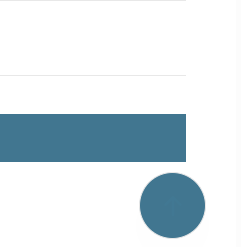

# Обзор и текущее состояние

- [Назад к индексу документации](../README.ru.md)
- [Обзор проекта (корневой README)](../../README.ru.md)

## Назначение

Этот документ фиксирует:

- что уже реализовано в пакете;
- какие инварианты нельзя нарушать при дальнейшей разработке;
- какие точки расширения доступны проектам-потребителям.

`django-scroll-to-top` отрисовывает ровно один элемент «прокрутка наверх».
Его единственный публичный контракт для сайта — inclusion-тег
``; всё, что касается внешнего вида и поведения, берётся из
конфигурации в базе данных, а не из аргументов тега.



## Поток «от запроса к отрисовке»

```
Настройки Django (режимы установки / инфраструктуры)
  -> разрешённая конфигурация из БД (по области: «site» или «admin»)
  -> неизменяемый типизированный payload рендерера  (renderer.py — не ORM-объект)
  -> шаблон Django + один санитизированный SVG + ассеты с пространством имён
  -> браузерный слой: машины состояний видимости / прокрутки / столкновений / скрытия
```

Конфигурация разрешается не более одного раза за запрос (профиль сайта →
глобальный → безопасные встроенные значения) и кэшируется по области. Без
конфигурации в БД элемент всё равно отрисовывается из безопасных встроенных
значений.

## Что реализовано

- **Публичный контракт для сайта** — inclusion-тег ``
  (и ``) в `templatetags/scroll_to_top.py`.
  Визуальных аргументов у тега нет.
- **Модель данных** (`models.py`) — `ScrollTopProfile` (область `site`/`admin`,
  необязательный `site_id` Sites Framework, `is_enabled`; «живая» ревизия
  определяется по статусу ревизии, а не по хранимому указателю),
  `ScrollTopRevision` (полный снимок внешнего вида и поведения со статусом
  `draft`/`published`/`archived`) и `ScrollTopUploadedIcon`.
- **Сервисы жизненного цикла** (`services.py`) — атомарные `publish_revision`,
  `create_draft_from_revision`, `rollback_to_revision`, а также разрешение
  профиля и опубликованной ревизии.
- **Разрешение и кэш на запрос** (`site_config.py`) — поиск «профиль сайта,
  затем глобальный» со счётчиком поколения кэша по области.
- **Единый рендерер** (`renderer.py`) — возвращает типизированный, удобный для
  сериализации `RenderPayload`/`RenderContext`, общий для отрисовки на сайте,
  внедрения в админку и живого предпросмотра. Никогда не ORM-объект.
- **Интеграция со стандартной админкой Django** — UX настройки (`admin.py`,
  `forms.py`), живой предпросмотр (`admin_preview.py`) и внедрение в подвал через
  `templates/admin/base_site.html` обычным разрешением шаблонов (без middleware и
  monkeypatching `AdminSite`).
- **Каталог иконок** (`icons/`) — строгий XML-санитайзер SVG `sanitizer.py`,
  `recolor.py`, `registry.py` (источники builtin / developer / uploaded) и
  вкомплектованный набор Tabler в `icons/tabler/` (MIT, с `LICENSE.tabler.txt` и
  `manifest.json`).
- **Путь стилей для строгого CSP** (`styles.py`, `views.py`, `urls.py`) —
  версионированный эндпоинт таблицы стилей того же источника, который передаёт
  проверенные значения цвета и размеров без `unsafe-inline`.
- **Браузерный слой** (`static/django_scroll_to_top/`) — `scroll-to-top.{css,js}`
  и воспроизводимо минифицированные `*.min.*`, предоставляющие
  `window.djstt.{init,refresh,destroy}` и DOM-события `djstt:*`, с необязательным
  `obstacle-adapter.js` для плавающих виджетов.
- **Системные проверки и диагностика** (`checks.py`) — `dstt.W001`–`dstt.W010`,
  а также management-команды `scroll_to_top_diagnose` и
  `scroll_to_top_check_contrast`.
- **Помощники по контрасту** (`contrast.py`) — только рекомендательные: контраст
  сообщается, но не навязывается.
- **Локализация** — английские канонические строки-источники и вкомплектованный
  русский gettext-каталог (`locale/ru/LC_MESSAGES/`).

## Проверка на демо-проекте

Автономный демо-проект Django находится в `demo/` (небольшое приложение
`library` с наполненным контентом и настроенным базовым шаблоном). На нём
сквозным образом проверяются:

- добавление приложения к уже работающему сайту;
- одиночная вставка тега в базовый шаблон;
- подключение URLConf пакета для эндпоинта таблицы стилей при строгом CSP;
- регрессия обычных страниц и админки после изменения конфигурации.

## Покрытие тестами

Набор в `tests/` проверяет описанные контракты в модулях, среди которых
`test_renderer`, `test_lifecycle`, `test_site_config`, `test_admin_integration`,
`test_admin_preview`, `test_styling`, `test_css_contract`, `test_visibility_scroll`,
`test_collision_contract`, `test_dismissal`, `test_runtime_contract`,
`test_svg_sanitizer`, `test_registry`, `test_security`, `test_accessibility`,
`test_diagnostics`, `test_hooks` и `test_localization`.

Запуск полного набора:

```console
python -m pytest
```

## Обратная связь и текущие ограничения

Это ранний релиз (`0.x` beta). Перечисленные области явно поддерживаются в режиме
best-effort и выигрывают от отзывов из реальной эксплуатации через
[GitHub issues](https://github.com/kroxiksut/django-scroll-to-top/issues):

- **Интеграция с админкой** — тестовой матрицей совместимости покрыты только
  стандартные шаблоны Django Admin. Пользовательские экземпляры `AdminSite`,
  переопределённые базовые шаблоны админки и сторонние admin-темы поддерживаются
  в режиме best-effort; сообщайте, что работает, а что нет.
- **Поведение фронтенда** — обход коллизий с реальными плавающими виджетами
  (cookie-баннеры, launcher'ы чатов, sticky-навигация, стеки toast), размещение
  при разных размерах viewport и safe-area, доставка при строгом CSP,
  наследование темы со сторонними admin-темами и слои partial navigation (HTMX,
  Turbo).
- **Доступность в реальных браузерах** — полный аудит WCAG 2.2 AA и проверка zoom
  (200%/400%) в реальных браузерах запланированы как отдельные этапы стабилизации
  (см. roadmap в корневом README).

О том, как составить полезный отчёт, см. [CONTRIBUTING.ru.md](../../CONTRIBUTING.ru.md).

## Связанные разделы

- [Быстрый старт](./quickstart.md)
- [Архитектура и границы пакета](../../ARCHITECTURE.md)
- [Правила перевода](../i18n/README.ru.md)
