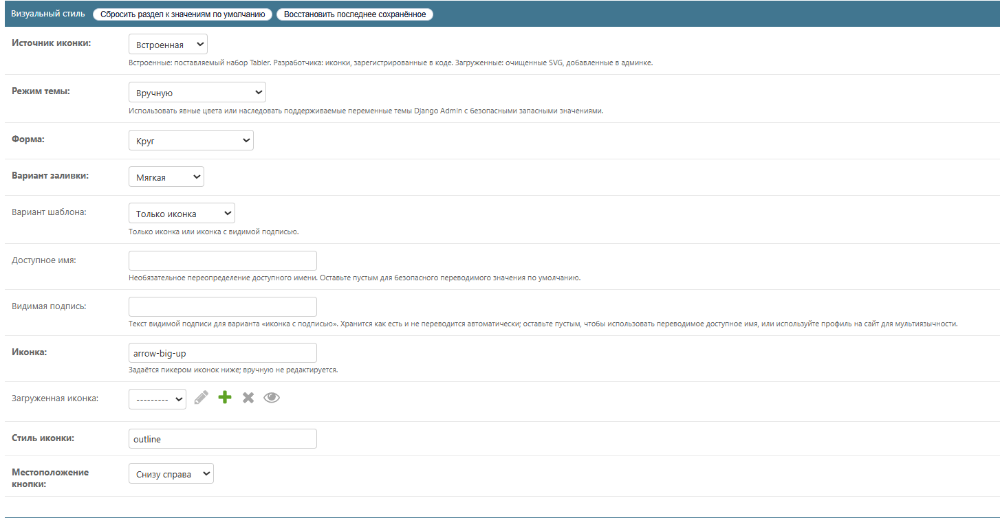
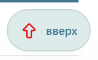
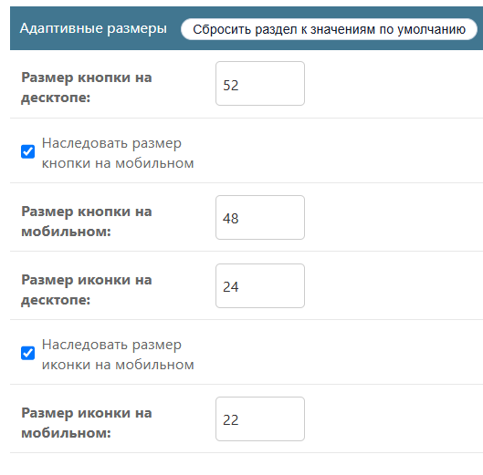
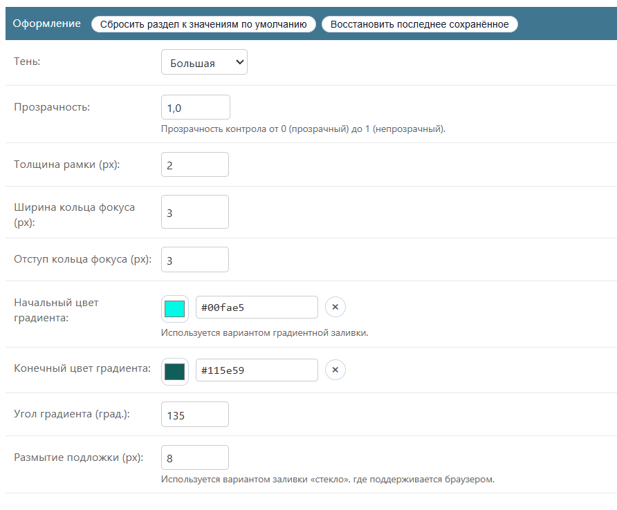
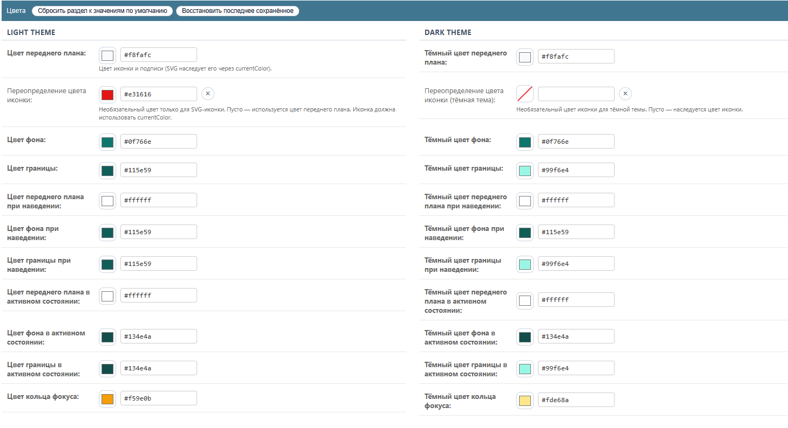
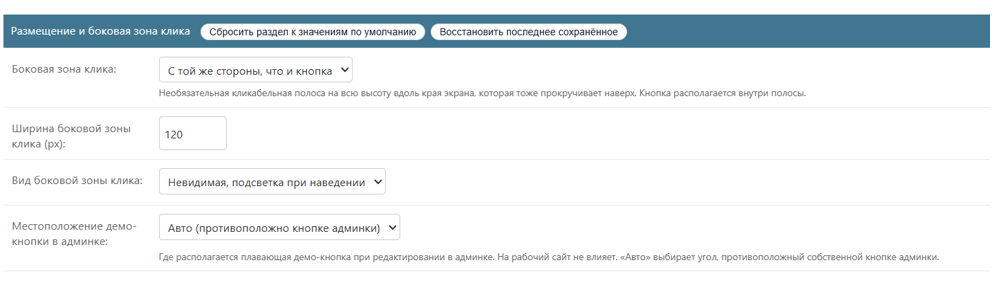
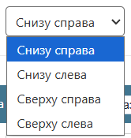
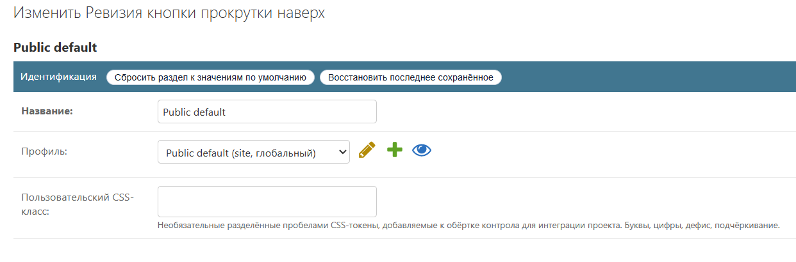

# Представление: шаблоны, цвета, размеры и иконки

- [Назад к индексу документации](./README.md)
- [Админка: профили, ревизии, публикация и откат](./operations-admin.md)

Внешний вид строится из управляемых CSS-классов пакета, выбираемых полями
ревизии, — никогда из произвольных шаблонов или CSS в базе данных. Неизвестные
формы, заливки и тени откатываются к безопасным значениям, а режим forced-colors
нейтрализует любой вариант. Все перечисленные поля принадлежат
`ScrollTopRevision`. Скриншоты показывают область «site»; область «admin»
предлагает идентичную форму.

## Шаблон и форма

- **Вариант шаблона** (`template_variant`): `icon-only` или `icon-label` (иконка
  с видимой подписью).
- **Форма** (`shape`): `circle`, `square`, `rounded-square`, `pill`.
- **Вариант заливки** (`fill_variant`): `solid`, `outline`, `soft`, `ghost`,
  `glass` (полупрозрачная с запасным backdrop-blur), `gradient` (два цвета и угол).

Превью форм ниже сделаны на **мягкой** заливке, чтобы был виден контур; форма по
умолчанию — **круг** со скриншотов обзора.

Варианты заливки (`solid`, `outline`, `soft`, `ghost`, `glass`, `gradient`):

Вариант шаблона `icon-label` отрисовывает иконку с видимой подписью:

## Размеры (десктоп первичен, мобильные наследуют или переопределяют)

- Размер кнопки: `size_desktop`, `size_mobile_inherit`, `size_mobile`.
- Размер иконки: `icon_size_desktop`, `icon_size_mobile_inherit`,
  `icon_size_mobile`.

Минимальный порог цели сохраняет элемент доступным независимо от заданного
размера; см. [accessibility.md](./accessibility.md).

## Параметры стиля

- `shadow_preset` (`none` / `small` / `medium` / `large`), `opacity` (0–1),
  `border_width`, `focus_ring_width`, `focus_ring_offset`.
- Градиентная заливка: `gradient_start_color`, `gradient_end_color`,
  `gradient_angle`.
- Стеклянная заливка: `backdrop_blur` (применяется там, где поддерживает браузер).

## Цвета и режим темы

`theme_mode` — это либо `manual` (явные цвета), либо `inherit_admin_theme`
(наследовать поддерживаемые переменные темы админки Django с безопасными
откатами плюс адаптерные хуки с пространством имён `--dstt-admin-*` для сторонних
тем админки).

У каждого состояния есть светлые и тёмные поля цвета, проверяемые как hex в
`clean()`:

- Светлые: `foreground_color`, `background_color`, `border_color` и их варианты
  `hover_*` и `active_*`, плюс `focus_ring_color`.
- Тёмные: соответствующие поля `dark_*`.

Цвет иконки разрешается по приоритету: **переопределение цвета иконки**
(`icon_color` / `dark_icon_color`), если задано, иначе **цвет переднего плана**
(он же цвет подписи). Переопределения влияют только на иконки, рисующие через
`currentColor`.

## Размещение и боковая зона клика

- **Угол** (`corner`): `top-left`, `top-right`, `bottom-left`, `bottom-right`.
- **Боковая зона клика** (`hot_zone_placement`): необязательная полоса во всю
  высоту вдоль края экрана, которая тоже прокручивает наверх (`none` / `button` /
  `left` / `right`), с `hot_zone_width` и `hot_zone_appearance`
  (`hover` / `hidden` / `visible`).
- `admin_demo_corner` влияет только на то, где стоит плавающая демо-кнопка при
  редактировании в админке; на живой сайт это не влияет.

## Иконки

У единого каталога три источника (`icon_source`):

- `builtin` — вкомплектованный стартовый набор Tabler (уже использует
  `currentColor`, поэтому перекрашивается автоматически);
- `developer` — иконки, зарегистрированные доверенным кодом проекта через
  `register_developer_icon(...)`;
- `uploaded` — санитизированные SVG, добавленные через админку
  (`ScrollTopUploadedIcon`).

`icon_name` задаётся пикером иконок в админке (не редактируется вручную), а
`icon_style` выбирает outline или filled там, где есть оба. Чтобы иконка
подхватила заданный цвет, она должна рисовать через `currentColor`
(`fill="currentColor"` / `stroke="currentColor"`). Многоцветные/оригинальные
загруженные иконки сохраняют свои цвета и игнорируют поля цвета. Набор Tabler
лицензирован по MIT; см. [THIRD_PARTY_LICENSES.md](../../THIRD_PARTY_LICENSES.md).

## Подписи и класс интеграции

- `aria_label` — необязательное переопределение доступного имени; пусто — берётся
  переведённое значение по умолчанию.
- `label_text` — видимая подпись для варианта «иконка с подписью» (хранится
  как есть, не переводится автоматически; для мультиязычных сайтов используйте
  профиль на конкретный Site).
- `custom_css_class` — необязательные токены через пробел (буквы, цифры, дефис,
  подчёркивание), добавляемые к обёртке элемента для интеграции проекта.

## Связанные разделы

- [Поведение и браузерный слой](./runtime.md)
- [Доступность](./accessibility.md)
- [Безопасность, санитизация SVG и CSP](./security-csp.md)
