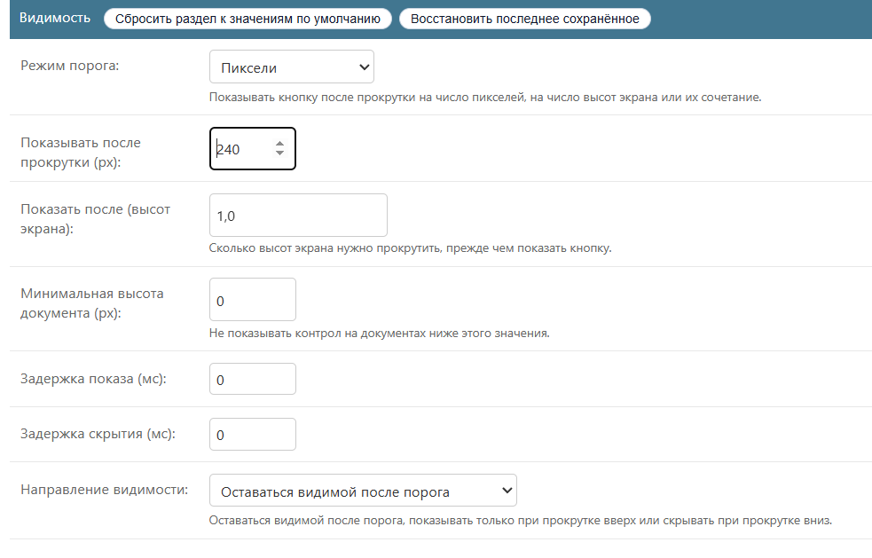
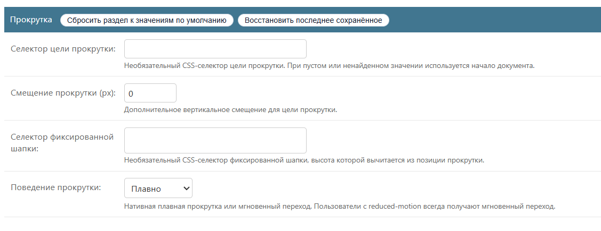
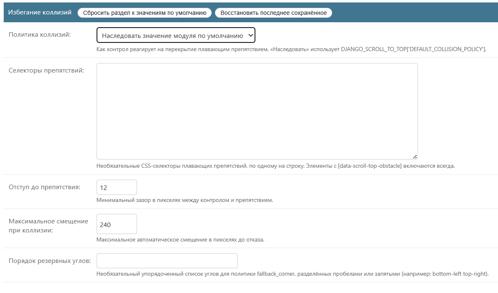
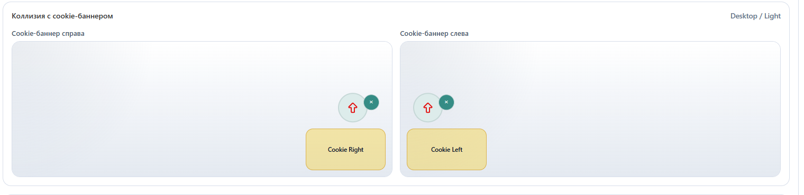
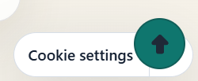
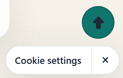
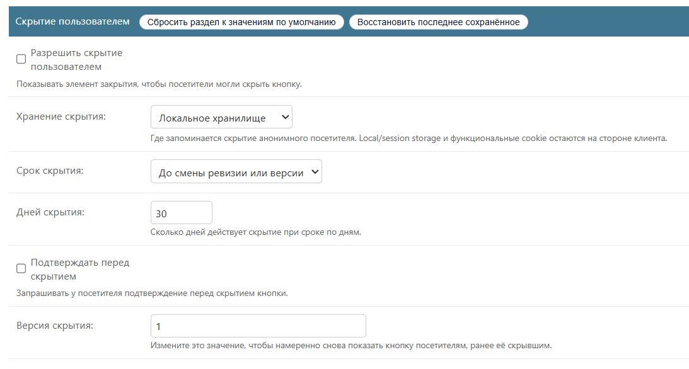
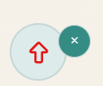

# Поведение и браузерный слой

- [Назад к индексу документации](../README.ru.md)
- [Представление: шаблоны, цвета, размеры и иконки](./presentation.md)

Браузерный рантайм поставляется как обычный ES5 (`scroll-to-top.js`,
воспроизводимо минифицируется в `scroll-to-top.min.js`). Он держит **видимость,
прокрутку, столкновения и скрытие как отдельные машины состояний**. Базовый
вариант без JavaScript — обычная ссылка к началу документа в выбранном углу;
обход столкновений, темизация и скрытие — прогрессивные улучшения.
Типизированный контракт опубликован в `scroll-to-top.d.ts`.

## Видимость и прокрутка

Каждая ревизия настраивает, когда элемент появляется и куда прокручивает:

- **Режим порога** (`threshold_mode`): `pixels`, `viewport` или `combined`, с
  `show_after_px`, `show_after_viewports` и порогом `min_document_height_px`,
  чтобы на коротких страницах элемент не показывался.
- **Направление** (`visibility_direction`): `always`, `scroll_up_only` или
  `hide_on_scroll_down`; плюс `show_delay_ms` / `hide_delay_ms`.
- **Цель прокрутки**: необязательный `scroll_target_selector` со `scroll_offset_px`
  и необязательный `fixed_header_selector`, высота которого вычитается, — с
  откатом к началу документа, если пусто или не найдено.
- **Поведение прокрутки** (`scroll_behavior`): `smooth` или `instant`, через
  нативный `window.scrollTo`. Пользователям с reduced-motion всегда даётся
  мгновенный переход.
- Отключение на уровне страницы: добавьте `data-scroll-top="disabled"` к `<body>`.




## Обход столкновений

Рантайм измеряет видимые прямоугольники препятствий и применяет
`collision_policy` ревизии (`inherit` / `ignore` / `shift` / `fallback_corner` /
`hide`; `inherit` использует `DEFAULT_COLLISION_POLICY`). Препятствия берутся из
элементов с пометкой `data-scroll-top-obstacle`, из `obstacle_selectors` ревизии
и из хука настроек `OBSTACLE_SELECTORS`. Параметры подстройки: `obstacle_gap`,
`collision_max_shift` и `fallback_corner_order`. Содержимое кросс-доменных
iframe никогда не инспектируется.




### Пример: куки-баннер django-cookies-152fz

Баннер `django-cookies-152fz` и его лаунчер закреплены в правом нижнем углу — том
же, что и элемент по умолчанию, — поэтому они перекрываются, пока элемент не
узнает о баннере:



Чинится целиком в админке, без кода. Откройте опубликованную ревизию и в секции
**Collision avoidance** задайте в **Obstacle selectors** лаунчер и панель баннера
(по одному селектору на строку), оставьте подвижную **Collision policy**
(`shift`) и сохраните:

```text
[data-cookie-banner-launcher]
[data-cookie-banner-panel]
```

Редактирование опубликованной ревизии сразу обновляет живой сайт. Теперь элемент
поднимается над лаунчером куки:



Полный разбор, включая альтернативы, — в
[Collision integration with django-cookies-152fz](../integration/django-cookies-152fz.md)
(на английском).

## Скрытие пользователем

Постоянное скрытие отделено от временной видимости и от админ-флага
`is_enabled`:

- `allow_user_dismissal` отрисовывает видимый элемент закрытия.
- `dismissal_storage`: `local`, `session`, функциональный `cookie` или `none`
  (в памяти). По умолчанию `local` ничего не хранит, пока посетитель не скроет.
- `dismissal_duration`: `persistent` (пока не изменится токен конфигурации или
  `dismissal_version`) или `days` через `dismissal_days`.
- `dismissal_requires_confirmation` спрашивает перед скрытием; `dismissal_version`
  — явный рычаг, чтобы снова показать элемент.

Ключи хранилища снабжены пространством имён по области, Site, токену конфигурации
и версии скрытия, а доступ к хранилищу терпимо относится к отказам/недоступности,
не ломая прокрутку.




## JavaScript-API: `window.djstt`

Одна документированная глобальная точка входа (версия контракта `version`
`"1"`):

| Метод | Назначение |
| --- | --- |
| `init(root?)` | Инициализировать каждый элемент внутри `root` (по умолчанию — весь документ). Идемпотентно. |
| `refresh(root?)` | Переизмерить и переоценить видимость; инициализирует любой новый элемент. |
| `destroy(root?)` | Демонтировать элементы, убрав слушатели и наблюдатели. |
| `dismiss(root?)` | Программно скрыть подходящие элементы (учитывая хранилище). |
| `restore(root?)` | Восстановить ранее скрытые элементы. |
| `debug(enabled, root?)` | Включить/выключить отладочные оверлеи столкновений. |

Для SPA / навигации по фрагментам вызывайте `window.djstt.init(fragmentRoot)`
после HTMX-подобной замены или `window.djstt.refresh()` после Turbo-подобной
полностраничной навигации.

## DOM-события

События `CustomEvent` с пространством имён всплывают от элемента
`.dstt-control-wrap`, поэтому их можно наблюдать на самом элементе, на `document`
или на `window`:

| Событие | `detail` |
| --- | --- |
| `djstt:show` / `djstt:hide` | `{ visible: boolean }` |
| `djstt:scroll-start` / `djstt:scroll-end` | `{ top: number }` |
| `djstt:dismiss` | `{ dismissed: boolean, storage: string }` |
| `djstt:restore` | `{ dismissed: boolean }` |

## Необязательный адаптер препятствий

Для плавающих виджетов, которые трудно нацелить одним статическим селектором,
поставляется необязательный адаптер `obstacle-adapter.js` (загружается только
там, где вы его подключаете; никогда не становится зависимостью).
`window.djsttObstacleAdapter.register({...})` помечает подходящую разметку через
`data-scroll-top-obstacle` (включая вставленные позже элементы) и связывает
события open/close/collapse с `window.djstt.refresh()`. Готовые пресеты
включают `djangoCookies152fz` и `stickyBottomNavigation`. Полный пример см. в
[обзоре проекта](../../README.ru.md).

## Публичная поверхность

Стабильная публичная поверхность — это `window.djstt`, события `djstt:*`,
атрибуты `data-dstt-*` на обёртке элемента, маркер `data-scroll-top-obstacle` и
шаблон `django_scroll_to_top/scroll_to_top.html`. Внутренние API сервисов и
моделей не входят в публичный контракт.

## Связанные разделы

- [Доступность](./accessibility.md)
- [Конфигурация (настройки и инфраструктура)](./configuration.md)
- [Демо-проект](./demo.md)
